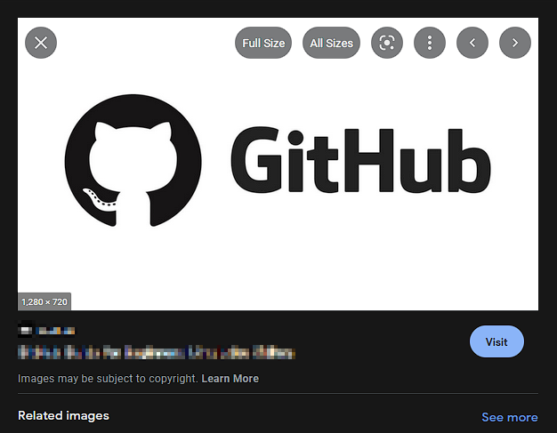

# Userscript: Google Images All Sizes
Remeber back in the day when google images used to have "All size" link right under the image you are viewing?

Well, this script does just that.

# Installation:
* Add [this script](./dist/google-images-all-sizes.js) to your userscript manager.
* Enjoy!

# Notes:
* Make sure to allow pop-ups if prompted!
* 'Full Size' button will simply open the preview image in a new tab. it does not force loading the full size image.
* Only English and Arabic languages are supported! (for now)
* Only '.com' and '.com.eg' domain extensions are supported! (for now)

